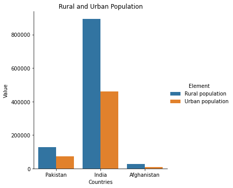

**Interpretation**

This graph shows comparison in rural and urban population in 2018, where it shows that rural areas of all countries has higher population than urban areas. But India has highest population as compared to Pakistan and Afghanistan. India has approximately 50% higher population in rural than urban areas while Pakistan and Afghanistan has approximately 30%-40% rural population than urban.
